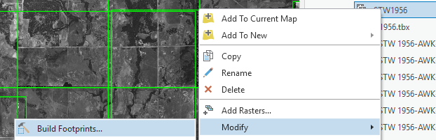

## About
Last Updated *[07/01/2019]*   
Created by [OSU Maps and Spatial Data](https://info.library.okstate.edu/map-room)

## Table of Contents
- Introduction 
- *[Mosaic Datasets]*
- - Photoshop
- - Creating a Mosaic Dataset
- - Building Overviews
- - Color Balancing
- - Seamlines
- - Downloading Rasters
- Conclusion
- Further Reading/Resources

## Introduction
Mosaic datasets allow you to easily work with large collections of raster and image data. These datasets can be created in ArcPro and make data management simple.

## *[Mosaic Datasets]*

#### Photoshop
When working with black and white images, it is important to make sure they are all in Grayscale. If they are not, this can be changed. We will start with one image to create an action and use this action to complete the rest.

1. Open photoshop and add one of the images you are using for the mosaic.
2. Select the *Windows* tab on the toolbar and click **Actions**.

3. A pop up should appear. Select the folder icon to **Create new set**.

4. Name the set and click **OK**.
5. Create a new action by clicking the **Create new action** icon in the *Actions* pane.

6. Name the action, put it in the set that was just created and choose a function key and color if desired. Click record.

7. Click the *Image* tab, hover over **Mode** and choose **Grayscale**.

8. A message should pop up. Click **Discard**.

9. Save the image and click **Stop playing/recording** in the *Actions* pane.

10. To use this newly created action on the remaining files, select the *File* tab, choose **Automate** and **Batch**.

11. In the new pane, select the desired folder of files and click **OK**. It should toggle through the files and convert them into Grayscale images.

12. Close Photoshop when finished.

#### Creating a Mosaic Dataset
1. Start a new project in ArcPro and set the file location as the file containing the already georeferenced images you wish to use for the mosaic dataset.
2. Add a folder connection to this file in the *Catalog* pane.
3. Select the files you wish to use and add them to the project. 
4. Right click on the geodatabase and click **Add to project**.

5. In the *Contents* pane, remove the images. They are now synchronized with the geodatabase.
6. Click the *Analysis* tab on the toolbar and select **Tools**.

7. Search for and select **Create Mosaic Dataset** in the new *Geoprocessing* pane. 

8. Set the output location as the project's geodatabase, give it a name, set the coordinate system to that of the current map and ensure **Product Definition** is set to **None**. Then click **Run**.

9. In the *Catalog* pane, you should find the mosaic dataset by expanding the geodatabase. Right click the mosaic dataset and select **Add Rasters**.

10. In the *Geoprocessing* pane, make sure the *Raster Type* is set to **Raster Dataset**. Under *Input Data*, click the **Browse** button and select the folder that contains the data you wish to use. Click **Run** to generate rasters.

11. The rasters should generate, but you may have to zoom in to see the images that are being used.

12. In the *Catalog* pane, right click the mosaic dataset, point to **Enhance** and select **Calculate Statistics**.

13. Accept the defaults and click **Run**.

13. Right click the mosaic dataset, point to **Modify** and select **Build Footprints**

14. Make sure the **Computation Method** is set to **Radiometry**.

15. Set the **Minimum Data Value** and **Maximum Data Value** as desired. The Minimum Data Value is the lowest valid pixel value and the Maximum Data Value is the highest valid pixel valuen. All values not included in this range will be removed.

16. Set the **Approximate Number of Vertices** as desired. This indicates the number of vertices the footpring polygon will include.

17. Set the **Shrink Distance** as desired. This is the distance value that the polygon will be reduced in size. Think of it as "trimming the edges" of the image.

18. The **Skip Overviews** and **Update Boundary** boxes are checked. 

19. Click **Run**.

20. Save the project.

#### Color Balancing
Sometimes, if images come from different sources, they may appear lighter or darker than their neighboring images. This can be rectified to some extent by color balancing.

1. To begin color balancing, add the JPG or TIF of the file that has a good distribution of light and dark colors to the map. This file will later be removed.
2. Right click the mosaic dataset in the *Catalog* pane, hover over **Enhance** and select **Color Balance**.

3. Set the **Balance Method** to **Histogram** and the **Target Raster** to the JPG or TIF file you just added. Leave **Block Field** empty and click **Run**.

4. Under the *Appearance* tab of the toolbar, you can alter the layer's contrast, brightness and gamma until the picture is displayed as desired. 

5. Save the project.

#### Seamlines
1. To generate seamlines, right click the mosaic in the *Catalog* pane, hover over **Enhance** and select **Generate Seamlines*.

2. Set the **Area of Interest** to **Boundary**.

3. Under **Processing**, the **Request Size** can be altered to make the seamlines more or less precise.

4. Click **Run**.

5. Save the project.

## Conclusion

## Further Reading/Resources

[Return to Top](#about)
